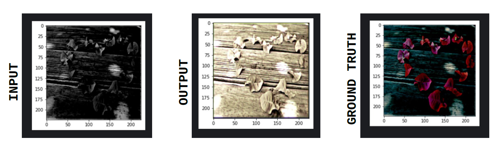
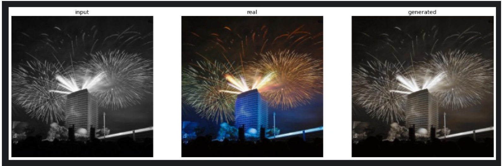
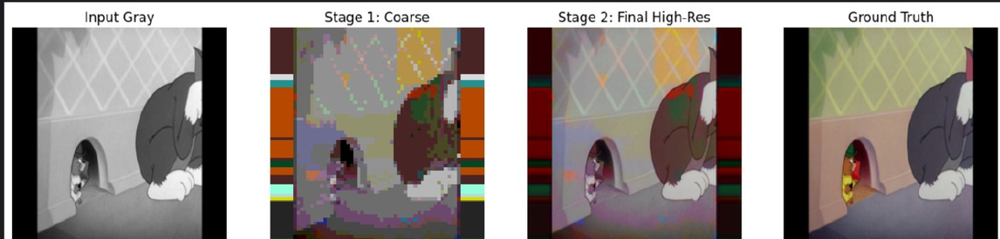
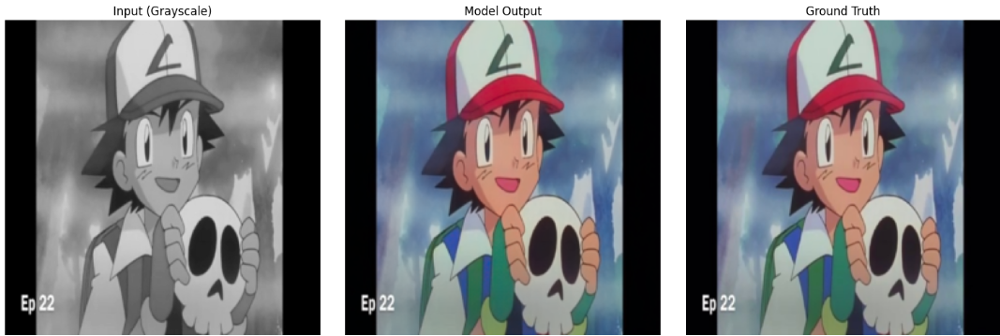
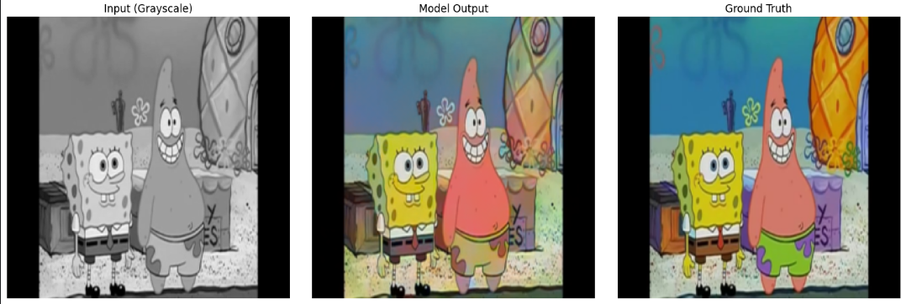
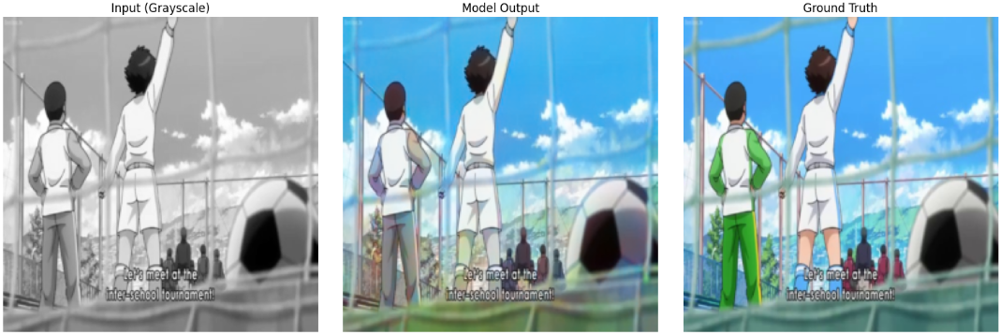

# **Cartoon Image Colorization — Final Report**  

<video controls width="320" height="240">
    <source src="static/DL Final Video - Eshan, Samyaka, Shreyansh.mp4" type="video/mp4">
    Your browser does not support the video tag.
</video>

[Video on yotube](https://www.youtube.com/watch?v=eV6tJy8mDlk)

## **1. Introduction**
Image colorization is the task of converting a grayscale image into a plausible color version by predicting color information for each pixel. It is widely used in:
- Historical image restoration  
- Medical imaging  
- Comic/manga enhancement  
- Cinematic & animation workflows  

Colorization is an **image-to-image translation problem**. Instead of predicting RGB directly, we use the **Lab colorspace**, where:
- **L** = luminance (input)  
- **a, b** = color channels (predicted)

The input **L** is then combined with the predicted **ab** color channels to form the final output.

---

## **2. Cartoon Colorization**
Cartoon Colourisation is a niche within image colourisation, which focuses on the colour conversion of black and white animated image frames.
- Unlike natural images, which provide textural cues for colour, cartoons often utilise **flat shading**. 
- The network must learn precise segmentation to ensure color does not **'bleed'** across the distinct black outlines of the line art  
- The model must avoid 'averaging' conflicting possibilities (which leads to desaturated, brownish outputs) and instead make distinct stylistic choices.
 

---

# **3. Review of Existing Methods**

## **3.1 DDColor**
A state-of-the-art technique using:
- **Dual Decoder architecture**  
- Pixel decoder for spatial details  
- Transformer-based color decoder for semantic aware color prediction  
- A **Colorfulness Loss** to boost vibrancy 

Strengths:
- Very low FID  
- Fast (~96× faster than transformer baselines like ColTran)  
- Minimizes color bleeding  

Limitations:
- Trouble with transparency  
- No user controls  

---

## **3.2 Deep Cartoon Colorizer (DCC)**
A fully automatic CNN-based encoder–decoder trained on vintage Disney frames.  

Strengths:
- SSIM ≈ 0.94, UQI ≈ 0.97  
- Users preferred its results over Zhang et al. 87% of the time  
- Clean boundaries, stable regions  

Limitations:
- Weak on monochrome cartoons  
- Potential desaturation of main characters  

---

## **3.3 AutoCaCoNet**
A U-Net based conditional GAN with self-attention, followed by trapped-ball segmentation and mean-based color correction.  

Strengths:
- Best FID = 44.853  
- Good edge cleanliness and regional consistency  

Limitations:
- Shading inconsistencies  
- Some color bleeding  

---

# **4. Experiments**

## **4.1 CNN Baseline**
A simple 4-layer encoder-decoder cnn. With 2 3x3 Conv2d layers and 2 3x3 ConvTranspose layers.
Trained on the Mean Pairwise Squared Error Loss

Bottleneck Layer with 12 features

---

## **4.2 WGAN Experiment — Expanded Architecture Details (From Notebook)** 

### **Generator — Res-U-Net for ab-channel prediction**
The generator takes the **L-channel** grayscale image and outputs a **2-channel ab map**. In the notebook, the generator follows a **Res-U-Net hybrid**:

#### **Encoder (Downsampling path)**
- Several convolutional blocks with:
  - Conv2D  
  - InstanceNorm or BatchNorm  
  - LeakyReLU  
- Feature depth increases progressively  
- Skip connections stored for the decoder  

#### **Residual Blocks**
Inserted at bottleneck:
- Conv → Norm → ReLU → Conv → Norm  
- Skip connection around block  

#### **Decoder (Upsampling path)**
- Transposed Convolutions or Upsample+Conv  
- Skip connections from encoder  
- Final layer outputs **2-channel (a,b)**  

**Key advantage**:  
Skip connections preserve edges → essential for cartoons.

---

### **Critic (Discriminator) — PatchGAN**
- Sequential Conv2D layers with stride=2  
- InstanceNorm  
- LeakyReLU(0.2)  
- PatchGAN outputs **N×N patch map**, not single scalar  

This allows:
- Local realism judgment  
- Better texture/color granularity  

---

### **Loss Functions**

#### **Critic loss**
$$
L_D = \mathbb{E}[D(\hat{x})] - \mathbb{E}[D(x)] + \lambda \cdot GP
$$

#### **Generator loss**
$$
L_G = -\mathbb{E}[D(\hat{x})] + \alpha \cdot L_{L1}
$$

Where:
- **Gradient Penalty (GP)** stabilizes training  
- **L1 reconstruction loss** ensures accurate color 

---

### **Training Observations**
- WGAN-GP stabilizes the generator  
- Good edge preservation  
- Fewer artifacts than vanilla GANs 

---

# **4.3 ColTran**  
The ColTran architecture is **fully transformer-based** and performs colorization in three stages.

## **Stage 1 — Autoregressive Coarse Colorizer (64×64, 512-token palette)**  
ColTran predicts a **single 512-color token per pixel**, representing a quantized RGB triplet. 

### **Key Components**

### **1. Axial Self-Attention**
- Alternating **row** and **column** attention  
- Complexity reduced from O(D²) → O(D√D)  
- Global receptive field in 2 layers  

---

### **2. Conditional Transformer Layers**
ColTran introduces conditional versions of:
- q, k, v projections (scaled & shifted by grayscale embedding)  
- MLP output modulation  
- LayerNorm parameters  

This allows much stronger conditioning on the grayscale structure.

---

### **3. Autoregressive Raster-Scan Generation**
Pixels generated in raster order:
$$
(x_{1,1}, x_{1,2}, ..., x_{1,W}, x_{2,1}, ...)
$$

With:
- Outer decoder → masked column attention  
- Inner decoder → masked row attention  

Each pixel depends only on past pixels — ensures high coherence.

---

## **Stage 2 — Color Upsampler**
Upsamples:
- **512-token coarse colors → 8-bit RGB**

Uses:  
- Row/column attention  
- Per-channel embedding 

---

## **Stage 3 — Spatial Upsampler**
Upscales:
- **64×64 → 256×256**  
- Starts with area interpolation, then transformer refinement 

---

## **Loss Function**
$$
L = (1-\lambda)\log p_c + \lambda \log p_{ec} + \log p_{ec↑} + \log p_{es↑}
$$

Where:

- $(p_c)$ = autoregressive coarse model  
- $(p_{ec})$ = auxiliary parallel model  
- $(p_{ec↑})$ = color upsampler  
- $(p_{es↑})$ = spatial upsampler  

---

---

# **5. Proposed Method**
Using a Dual Decoder Colorizer model:
- **ConvNeXt-Tiny** encoder  
- Multi-scale Pixel decoder + single-scale color decoder  
- Dot-product fusion head  
- L1 Loss + Perceptual loss  

Parameter count reduced (from original DDColor):
- **227.9M → 43.4M**  

---

# **6. Final Results**
- Preserves edges in cartoons  
- Trains efficiently  
- Produces vibrant results after saturation boosting  

| Model | FID $\downarrow$ | PSNR $\uparrow$ | SSIM $\uparrow$ | MS-SSIM $\uparrow$ | VIF $\uparrow$ |
| :--- | :--- | :--- | :--- | :--- | :--- |
| **Our Model** | **26.7301** | 20.5951 | 0.8842 | 0.8715 | **0.9012** |
| **AutoCaCoNet** (Base) | 110.683 | 14.343 | 0.683 | N/A | N/A |
| **AutoCaCoNet** (Full)* | 44.853 | 13.511 | 0.633 | N/A | N/A |
| **DCC** | N/A | **26.48** | **0.92** | **0.94** | 0.66 |

*\*Full: w/ self-attention, segmentation, and color correction.*

---

train_model contains our final model code and the different folders contain the different experiments we did.
